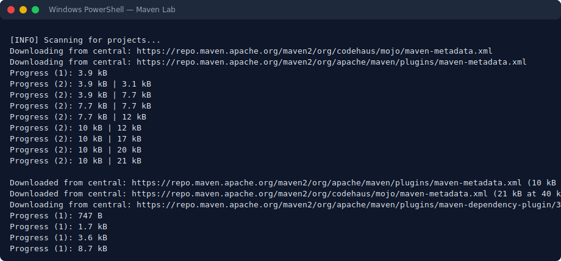

UNIT IV: BUILD AUTOMATION WITH MAVEN
WEEK 10: MANAGING DEPENDENCIES AND LEVERAGING MAVEN PLUGINS

Topic A. THE PARENT POM CONCEPT
Large organizations often maintain dozens of microservices. Rather than duplicating configuration across every project, teams create a "Parent POM." Child modules inherit shared dependency versions, properties, and plugin settings from this parent, ensuring uniform standards across the entire codebase.

Topic B. DEPENDENCY SCOPES
Not every dependency is needed at every stage. Maven uses scopes to control when a library is included:
- `compile` (Default): Needed for both compilation and execution. Bundled into the final artifact.
- `provided`: Required at compile time but expected to be supplied by the runtime environment (e.g., the Servlet API is provided by Tomcat).
- `runtime`: Not used during compilation but necessary when the application runs (e.g., a JDBC driver for MySQL).
- `test`: Only available during the testing phase (e.g., JUnit 5, Mockito).

Topic C. TRANSITIVE DEPENDENCIES AND CONFLICT RESOLUTION
When your project depends on Library X, and Library X internally requires Library Y, Maven automatically pulls in Library Y. This is known as a transitive dependency.
Conflicts arise when different dependency paths bring in incompatible versions of Library Y. Maven resolves this with the "Nearest Definition" rule — the version declared closest to the project root takes precedence. You can also manually exclude problematic transitive dependencies using the `<exclusions>` element.

Topic D. CENTRALIZED VERSION CONTROL WITH dependencyManagement
The `<dependencyManagement>` section, typically defined in a Parent POM, does not add any dependencies directly. Instead, it declares which version of each dependency should be used. When child modules list a dependency, they can omit the `<version>` tag and automatically receive the version specified by the parent.

Topic E. ESSENTIAL MAVEN PLUGINS
At its core, Maven is a plugin execution engine. Every lifecycle phase is handled by a plugin:
- Compiler Plugin: Compiles Java source code. Can be configured to target a specific Java version (e.g., Java 17 or Java 21).
- Surefire Plugin: Runs unit tests (JUnit, TestNG) during the `test` phase and produces test result reports.
- Shade Plugin: By default, a Maven-built JAR includes only your project's classes. The Shade plugin produces an "Uber JAR" (also called a Fat JAR) that extracts and bundles all dependency classes into a single, self-contained executable JAR.

Topic F. THE MAVEN WRAPPER (mvnw)
The Maven Wrapper is a pair of scripts (`mvnw` for Linux/Mac, `mvnw.cmd` for Windows) committed alongside your source code. When invoked, they automatically download and use the exact Maven version the project requires. This guarantees that CI/CD pipelines, new team members, and different machines all use a consistent Maven version without manual installation.

=======================================================
LAB EXERCISES — WEEK 10
=======================================================

### Lab Exercise 3: Debugging Transitive Dependency Conflicts
**Task Description:**
Your build is breaking because of a conflicting version of the `guava` library pulled in transitively. You need to inspect the dependency hierarchy to identify which path introduces the problematic version. What command should you execute?

**Answer:**
```bash
mvn dependency:tree -Dincludes=com.google.guava:guava
```
*How it works:* The `dependency:tree` goal outputs the full dependency graph. Adding `-Dincludes` narrows the output to only show branches that lead to the Guava artifact, making the conflict source easy to spot.

### Lab Exercise 4: Building a Self-Contained Executable JAR with Shade
**Task Description:**
Your CLI application depends on the Apache Commons library. Add the `maven-shade-plugin` configuration to your `pom.xml` so that running `mvn package` generates a single runnable JAR with `com.example.App` as the entry point.

**Answer:**
```xml
<build>
  <plugins>
    <plugin>
      <groupId>org.apache.maven.plugins</groupId>
      <artifactId>maven-shade-plugin</artifactId>
      <version>3.2.4</version>
      <executions>
        <execution>
          <phase>package</phase>
          <goals>
            <goal>shade</goal>
          </goals>
          <configuration>
            <transformers>
              <transformer implementation="org.apache.maven.plugins.shade.resource.ManifestResourceTransformer">
                <mainClass>com.example.App</mainClass>
              </transformer>
            </transformers>
          </configuration>
        </execution>
      </executions>
    </plugin>
  </plugins>
</build>
```

*Viewing the dependency tree output in PowerShell*

```powershell
cd labs\lab4-maven-project
mvn dependency:tree
```

